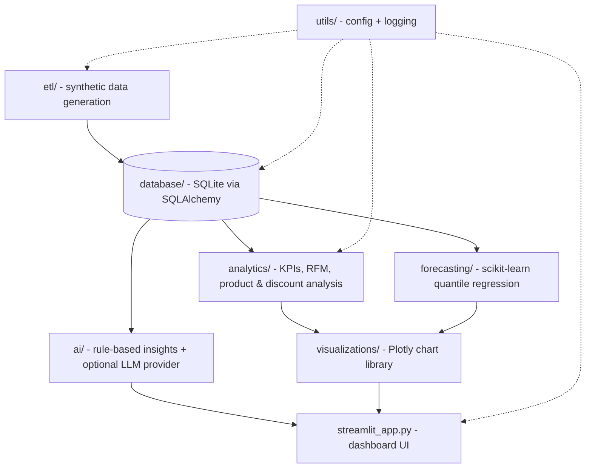

# AI Sales Analytics Dashboard

An interactive, AI-assisted sales analytics dashboard built with **Python, Pandas, SQL, and Streamlit** - covering revenue trends, regional performance, customer segmentation (RFM), product profitability, and short-term sales forecasting, on a synthetic ~100K-row e-commerce dataset.

## Overview

The dashboard answers the questions a business manager actually asks:
which region and which products drive revenue, who the best customers
are, where margin is leaking, and what the next 30/90 days of sales are
likely to look like - plus a natural-language "AI Insights" tab that
answers ad hoc questions about the current view.

## Architecture



Orders, customers, and products are normalized into three SQLite tables.
The dashboard loads them once via a single join query into a pandas
DataFrame (cached with `st.cache_data`), then does all filtering and
aggregation in memory - at ~100K rows that's faster and simpler than
re-querying SQL on every sidebar interaction, while the handful of
heavier aggregate views (`database/queries.py`) still run as hand-written,
indexed SQL.

## Features

- **Executive summary**: revenue, profit, orders, customers, AOV, margin, growth %, automated plain-language insights
- **Revenue**: daily/weekly/monthly trend, category treemap, order-value distribution, day-of-week x month heatmap
- **Customers**: RFM segmentation, churn-risk buckets, repeat-customer rate, lifetime value ranking
- **Products**: top/worst performers, Pareto analysis, discount-vs-margin scatter, delivery-time by category, inventory recommendation (Restock / Hold / Discontinue)
- **Forecasting**: 30/90-day revenue projection with an 80% confidence interval
- **AI Insights**: ask questions in plain English (rule-based by default; drop in an OpenAI-compatible key for LLM-backed answers, no code changes required)
- Sidebar filters: date range, region, category, sub-category, city, sales channel, customer search
- Cached data loading, loading spinners, expandable detail sections, dark-mode-friendly `plotly_white` theme

## Installation

```bash
git clone <your-repo-url>
cd ai-sales-analytics-dashboard
python -m venv .venv && source .venv/bin/activate   # Windows: .venv\Scripts\activate
pip install -r requirements.txt
cp .env.example .env
```

## Dataset generation

The dataset is synthetic and generated locally - nothing to download.

```bash
python etl/generate_data.py   # writes data/raw/sales_data.csv (~100K rows)
python etl/load.py            # creates data/processed/sales_analytics.db
streamlit run streamlit_app.py
```

Re-running `generate_data.py` regenerates the same data (seeded, so it's
reproducible) - delete `data/processed/sales_analytics.db` first if you
want a clean reload rather than appended duplicates.

## AI Insights configuration

Works with zero setup (rule-based engine). To use a real LLM instead, set
in `.env`:

```
LLM_PROVIDER=openai
LLM_API_KEY=sk-...
LLM_MODEL=gpt-4o-mini
```

## Screenshots

*(Add screenshots here after your first local run, e.g.
`docs/executive-summary.png`, `docs/forecasting.png`.)*

## Folder structure

```
ai-sales-analytics-dashboard/
├── ai/                  # rule-based insights + LLM provider abstraction
├── analytics/           # KPIs, trends, customer (RFM/CLV/churn), product analysis
├── data/                # raw/ (generated CSV) and processed/ (SQLite DB)
├── database/            # SQLAlchemy models, raw SQL schema, session, queries
├── etl/                 # synthetic data generation + load into the DB
├── forecasting/         # scikit-learn quantile-regression revenue forecast
├── tests/                # pytest suite
├── utils/               # config (env vars) and logging
├── visualizations/      # Plotly chart-building functions
├── streamlit_app.py      # dashboard entry point
├── requirements.txt / requirements-dev.txt
└── pyproject.toml        # ruff / mypy / pytest config
```

## Running tests

```bash
pip install -r requirements-dev.txt
pytest
ruff check .
mypy .
```

## Future improvements

- Swap SQLite for Postgres in production (`DATABASE_URL` is the only change needed)
- Add authentication if deployed for a real team rather than run locally
- Replace the discount-band/velocity heuristics in `analytics/products.py` with a trained demand model
- Add a scheduled job to regenerate/refresh data instead of a manual script run
- Multi-currency / multi-country support (currently US-only)

## Resume bullets this project supports

- Built an interactive AI-powered Sales Analytics Dashboard using Python, Pandas, SQL, and Streamlit.
- Processed and transformed a 100K-row synthetic sales dataset to generate business KPIs and automated insights.
- Developed interactive dashboards for revenue trends, regional sales, RFM customer segmentation, and product performance.
- Implemented dynamic multi-dimensional filtering, hand-written optimized SQL queries, and scikit-learn-based sales forecasting.
- Designed a modular, normalized-database analytics pipeline with a provider-agnostic AI layer and full test coverage.

## License

MIT - see [LICENSE](LICENSE).
